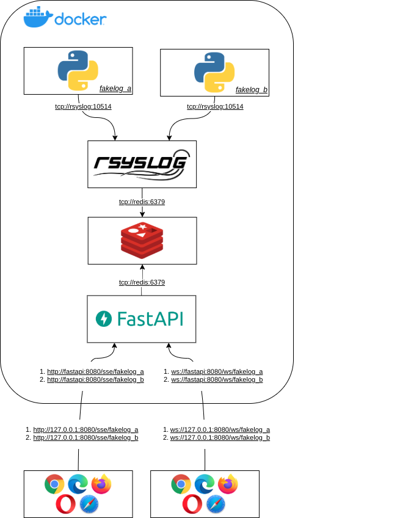

realtime-log-web-viewer
#######################

* **Date**: 10/11/2020

* **Autor**: @augustoliks | carlos.neto.dev@gmail.com

* **Objetivo**: Exibir log de aplicações em tempo real em um ambiente Web.

Tecnologias Utilizadas
----------------------

+--------------------+----------------------+
| Nome               | Versão               |
+====================+======================+
| Rsyslog            |                      |
+--------------------+----------------------+
| Redis              |                      |
+--------------------+----------------------+
| FastAPI            |                      |
+--------------------+----------------------+

Arquitetura da Solução
----------------------

As aplicações ``fakelog_a`` e ``fakelog_b``, dão origem aos logs. Os logs são reencaminhados para o Rsyslog via TCP. O trecho do código responsável conectar a aplicação com o Rsyslog. 

.. code-block:: python

    import loguru
    import logging
    ...

    logger.add(
        logging.handlers.SysLogHandler(address=('rsyslog', 10514))
    )

::

    Foi utilizado a biblioteca ``loguru`` por conta da simplicidade que ela oferece, porém sua presença não é obrigatória.

O Rsyslog foi configurado para satisfazer as seguintes três etapas: Entrada, Filtro/Transformação e Saída. 

Na etapa de Entrada, o Rsyslog foi configurado para receber os *log's* via protocolo TCP pela porta 10514. Segue o trecho que habilita esta funcionalidade.

:: 

    # Provides TCP syslog reception
    $ModLoad imtcp
    $InputTCPServerRun 10514

Já na etapa de Filtro/Transformação, os *log's* sofrem uma mudança na sua estrutura, de protocolo ``syslog`` para o protocolo ``gelf``.  Segue o trecho responsável por executar a transformação.

::

    template(name="gelf_containers" type="list") {
        constant(value="{\"_app_name\":\"")         property(name="fromhost")
        constant(value="\",\"host\":\"")            property(name="$myhostname")
        constant(value="\",\"short_message\":\"")   property(name="msg" format="json")
        constant(value="\",\"timestamp\":")         property(name="timegenerated" dateformat="unixtimestamp")
        constant(value=",\"_group\":\"lr\"}\n")
    }

Por fim, na etapa de Saída, os logs transformados na etapa anterior, são enviados para uma instância do Redis. O envio é feito utilizando o modelo de comunicação Publish/Subscribe. Assim, é correto afirmar que os logs são publicados em um canal do Redis. O nome do canal que será publicado o log, é definido pelo nome da aplicação que lhe-deu origem. Segue a configuração que implementa esta etapa:

::
    module(load="omhiredis")
    action(
        name="publish_redis"
        template="gelf_containers"
        server="redis"
        serverport="6379"
        type="omhiredis"
        mode="publish"
        key="channel_app"
        dynakey="on"
    )

